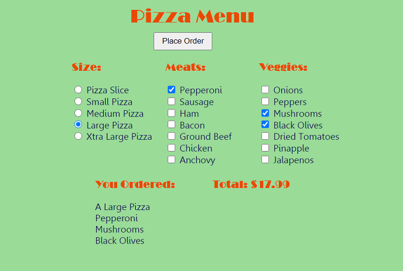

# Pizza Menu
This is a simple html page which utilizes both CSS and Javascript to create an interactive pizza menu. It takes your order and calculates the price. The interface consists of buttons to determine the pizza size and checkboxes to add toppings. There are both meat and vegetable toppings each with its own price.

Once the selections have been made, the JS adds all the combined costs and produces a result which is displayed to the user. This includes both the specific pizza chosen and the total price.

